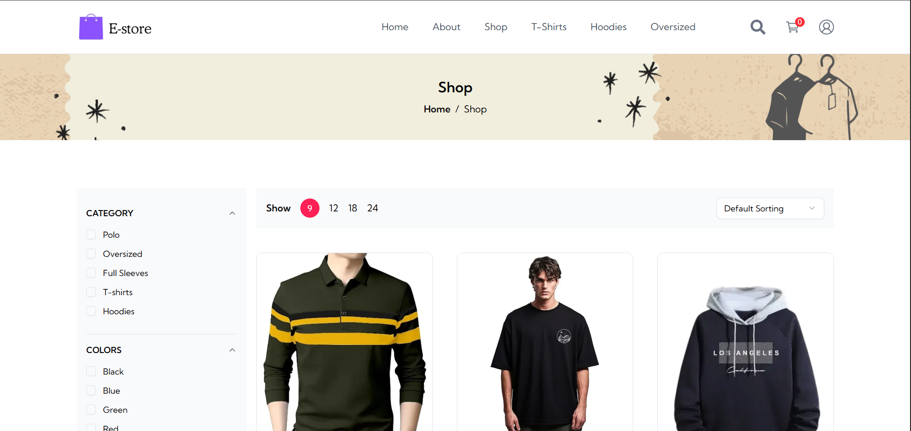
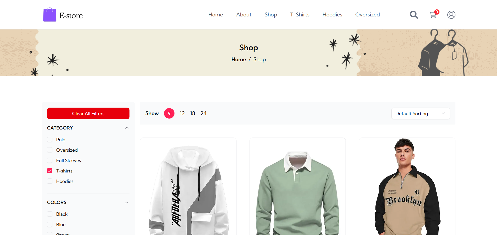
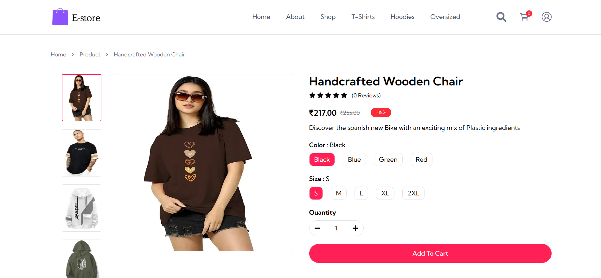
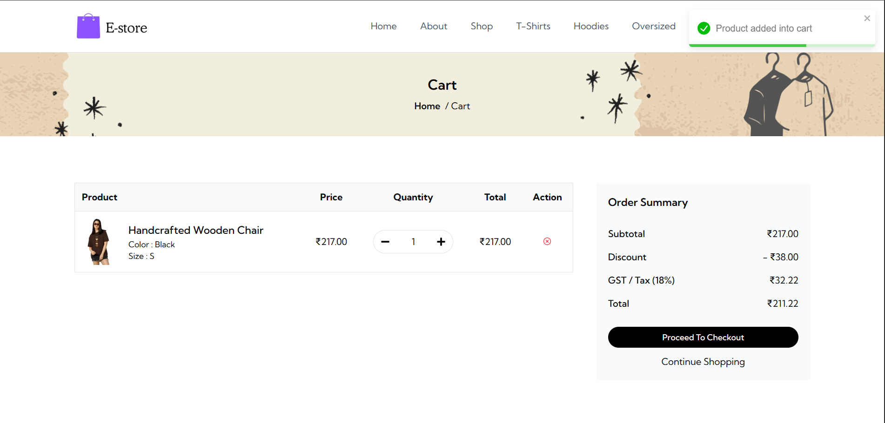
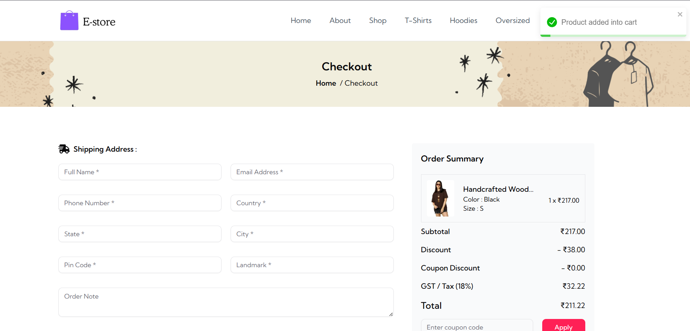
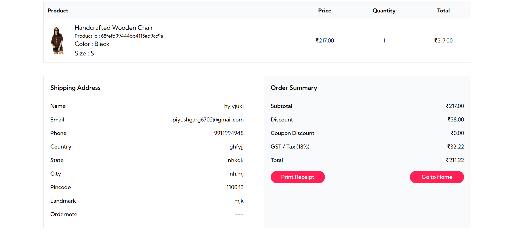
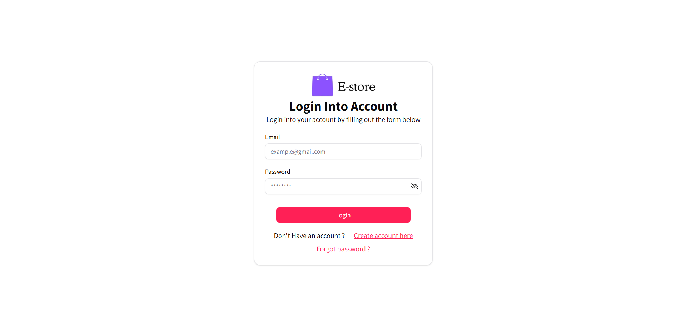
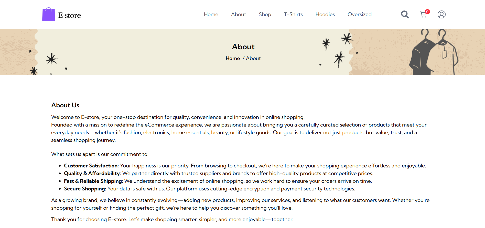
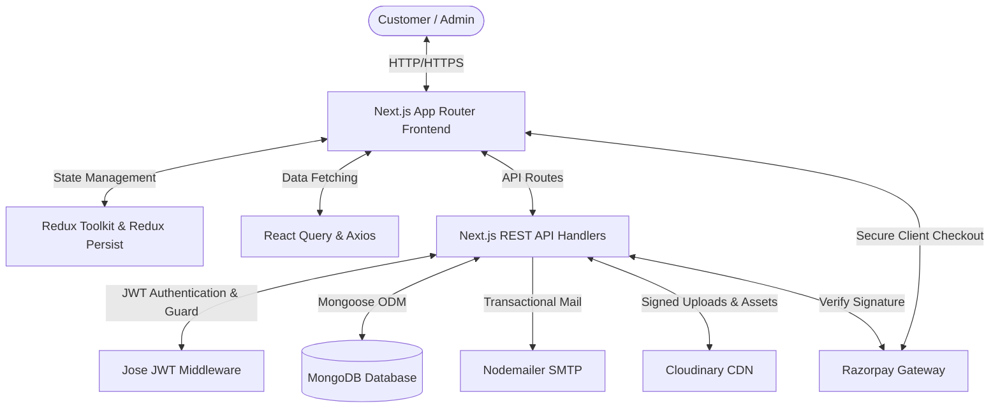

# 🚀 E-Commerce Platform

A production-grade full-stack e-commerce platform with customer storefront, advanced admin dashboard, secure payments, inventory management, and scalable architecture.

<p align="center">
  <a href="https://nextjs.org/"></a>
  <a href="https://react.dev/"></a>
  <a href="https://nodejs.org/"></a>
  <a href="https://www.mongodb.com/"></a>
  <a href="https://tailwindcss.com/"></a>
  <a href="https://redux-toolkit.js.org/"></a>
  <br />
  <a href="https://razorpay.com/"></a>
  <a href="https://cloudinary.com/"></a>
  <a href="https://vercel.com/"></a>
  <a href="LICENSE"></a>
  <a href="https://github.com/piyush-garg-web/NextCommerce"></a>
</p>

<p align="center">
  <strong>
    <a href="https://e-commerce-gilt-seven-85.vercel.app/">⚡ Live Demo</a> 
    &nbsp;•&nbsp; 
    <a href="https://github.com/piyush-garg-web/NextCommerce">💻 GitHub Repository</a> 
    &nbsp;•&nbsp; 
    <a href="https://www.linkedin.com/in/piyushgarg-dev">👔 LinkedIn Profile</a>
  </strong>
</p>

---

## 📌 Introduction

This project is a high-performance, full-stack e-commerce application designed to support production-level loads and workflows. Built with Next.js (App Router), React 19, and MongoDB, the system features a fluid customer storefront alongside a robust administration panel. 

The customer experience includes secure JWT authentication, real-time catalog search, advanced product filtering, and a state-persisted shopping cart integrated with the Razorpay payment gateway. Meanwhile, the administration portal allows managers to handle inventory matrices (color/size variants), track client activity, verify financial sales distributions via chart analytics, moderate reviews, manage discount coupons, and restore elements using a custom soft-delete trash recovery system.

---

## ❓ Why This Project?

Building a standard online shopping cart is relatively straightforward. However, resolving the challenges of a **production-grade e-commerce application** requires solving complex real-world technical problems:

1. **Transactional Integrity & Stock Validation**: Client-side prices and inventories can easily be tampered with. This project implements automatic server-side validation against MongoDB prior to generating Razorpay order IDs, ensuring customers are billed exactly according to dynamic pricing matrices and stock levels.
2. **Complex Variant Matrix Control**: Real retail items exist in multiple variants (e.g., shirt sizes and colors), each demanding its own SKU, image set, pricing tier, and inventory count. This application models these variants cleanly using referenced schemas.
3. **Database Fault Tolerance & Recovery**: Accidental deletion of products, categories, or reviews can cause cascading failures. The custom soft-delete trash bin provides a safe staging environment where administrators can instantly recover deleted records.
4. **Stateless Security**: Role-based access is validated through secure HTTP-only cookies (`access_token`) and decoded using Edge Middleware to ensure zero unauthorized API leakage.

---

## ⚡ Live Demo & Account Credentials

Explore the active platform using the following access configurations:

* **Live Demo URL**: [https://e-commerce-gilt-seven-85.vercel.app/](https://e-commerce-gilt-seven-85.vercel.app/)

| Account Type | Email Address | Password |
|---|---|---|
| **Admin Account** | `admin@example.com` | `AdminSecure123` |
| **Customer Account** | `customer@example.com` | `CustomerSecure123` |

---

## 📸 Visual Previews

Here are visual previews of the storefront and checkout screens:

#### Storefront Interface
| Landing Page | Shop Catalog |
| :---: | :---: |
|  |  |

| Filtered Catalog | Product Details |
| :---: | :---: |
|  |  |

| Shopping Cart | Secure Checkout |
| :---: | :---: |
|  |  |

| Order Confirmation | User Login |
| :---: | :---: |
|  |  |

| About Page |
| :---: |
|  |

---

## ⚙️ Key Features

### 🛍️ Customer Storefront
* **Authentication**: Login & registration flow featuring 6-digit OTP verification codes delivered via email.
* **Product Catalog**: Dynamic catalog rendering with fast page loads.
* **Fuzzy Product Search**: Fuzzy client-side search indexing utilizing Fuse.js.
* **Filters & Sorting**: Filter items by category, price, size, and color, or sort dynamically (price, alphabet).
* **Shopping Cart**: Client-side state persistence backed by Redux Persist.
* **Coupon Discounts**: Validate dynamic discount codes to adjust the final purchase total.
* **Secure Checkout**: Seamless Razorpay checkout integration with verification signatures.
* **Order History**: Review previous invoice orders, tracking statuses, and address breakdowns.

### 🛡️ Administrative Portal
* **Sales Analytics**: Custom Recharts interface displaying order counts, daily revenue statistics, and customer signups.
* **Product Management (CRUD)**: Easily add, edit, or remove catalog items.
* **Variant Matrix Creator**: Customize individual variants (color, size) with unique images, stock values, and pricing.
* **Category & Coupon Management**: Custom grids to configure active promo codes and dynamic category options.
* **Central Media Storage**: Control panel to view, track, or delete Cloudinary uploads.
* **Review Moderation**: Review and delete user reviews on products.
* **Soft-Deleted Trash Bin**: Restore categories, coupons, products, variants, and reviews or permanently delete them.

---

## 🛠️ Technology Stack

| Layer | Technologies Used | Description |
|---|---|---|
| **Frontend** | Next.js 15+ App Router, React 19, Tailwind CSS v4, Material UI (MUI), Radix UI | Modern responsive templates, unified design assets, and accessibility |
| **Backend** | Next.js API Routes, Node.js, JWT Authentication, Jose, BcryptJS | Edge-compatible JWT token creation and secure password encryption |
| **Database** | MongoDB Atlas, Mongoose | NoSQL cluster caching, indices, and schema configurations |
| **State Management** | Redux Toolkit, Redux Persist | Local storage persistence for client shopping carts |
| **Payments** | Razorpay Gateway | Real-time payment verification and invoices |
| **Storage** | Cloudinary API | Centralized media CDN hosting and signed uploads |
| **Email** | Nodemailer | Transactional notifications and verification links |
| **Deployment** | Vercel | Scalable cloud deployment |

---

## 📐 System Architecture

The application is built on a modular, unified Next.js architecture where client-side interactions communicate with backend services through protected routes.



### Architectural Flow:
1. **Frontend**: Receives customer inputs, validates state (Redux), and schedules server-side synchronization queries (React Query).
2. **API Routes**: Routes requests, checks user role authentication, and queries DB models.
3. **Authentication**: Edge middleware intercepts routes, verifying session tokens using the `jose` JWT library.
4. **Database**: Handles storage of structured documents using MongoDB and Mongoose.
5. **Payment Gateway**: Validates checkout, interfaces with Razorpay API, and confirms payment signatures server-side.
6. **Cloud Storage**: Uploads assets, generates signatures, and manages product images using Cloudinary.

---

## 📂 Project Structure

```text
├── app/                  # Next.js App Router root
│   ├── (root)/           # Shared layout route groups
│   │   ├── (admin)/      # Admin panel pages (/admin/*)
│   │   ├── (website)/    # Customer storefront (/shop, /cart, /orders, /profile)
│   │   └── auth/         # Authentication flows (/auth/login, /auth/register, OTP)
│   ├── api/              # Backend REST API endpoints
│   ├── globals.css       # Root stylesheet
│   └── layout.jsx        # Root HTML wrapper
├── components/           # Reusable React components
├── email/                # Nodemailer transactional templates (HTML converters)
├── hooks/                # Custom React hooks (React Query calls)
├── lib/                  # Helper utilities (db connection, validation schemas, toast alerts)
├── models/               # MongoDB Mongoose database schemas
├── public/               # Static assets & favicon files
├── routes/               # Navigation route constant configurations
├── screenshots/          # Repository visual documentation captures
├── store/                # Redux Toolkit store config & slices
├── .env.example          # Template configuration file
├── .gitignore            # Version control exclusions
├── LICENSE               # Open-source MIT license parameters
├── middleware.js         # Next.js custom JWT role-based router security
├── package.json          # Package manifest & scripts
└── README.md             # Repository documentation (this file)
```

---

## 📊 Database Design

The data layer uses referenced MongoDB schemas to map inventory connections cleanly:

* **User**: Customer profiles, cryptographic credentials, roles (`user`, `admin`), and email validation status.
* **Product**: Common catalog details, category references, descriptions.
* **ProductVariant**: Dependent variant sheets linking sizes, colors, pricing, SKUs, inventory stocks, and CDN image lists back to a `Product` parent.
* **Category**: Broad classification groups.
* **Coupon**: Active promotion matrices holding validation schemas.
* **Review**: Customer text reviews and star configurations.
* **Media**: Metadata records for media files.
* **Order**: Customer invoices containing shipping details, Razorpay signatures, and billing summaries.
* **OTP**: Valid temporary codes expiring automatically via MongoDB TTL (Time to Live) indexes.

---

## ⚡ API Endpoint Reference

All backend communication uses JSON payloads. Detailed payload details can be found in [docs/API.md](docs/API.md).

| Area | Endpoint | Method | Guard | Description |
|---|---|---|---|---|
| **Auth** | `/api/auth/register` | `POST` | Public | Registers a user and sends OTP |
| **Auth** | `/api/auth/verifyotp` | `POST` | Public | Validates signup email OTP |
| **Auth** | `/api/auth/login` | `POST` | Public | Authenticates credentials and sets session cookie |
| **Catalog** | `/api/shop` | `GET` | Public | Lists, sorts, and filters products |
| **Catalog** | `/api/product` | `GET` | Public | Fetches detailed product properties |
| **Cart** | `/api/cart-verification` | `POST` | User | Server-side validation of cart prices/stock |
| **Payment** | `/api/payment/get-order-id` | `POST` | User | Generates Razorpay transaction ID |
| **Payment** | `/api/payment/save-order` | `POST` | User | Cryptographic signature verification and order creation |
| **Admin** | `/api/product` | `POST`/`PUT`/`DELETE` | Admin | Product catalog CRUD (soft-delete) |
| **Admin** | `/api/coupon` | `POST`/`PUT`/`DELETE` | Admin | Coupon configuration CRUD |
| **Admin** | `/api/dashboard` | `GET` | Admin | Fetch sales statistics and chart coordinates |

---

## 🔧 Installation & Local Setup

Deploy the application locally in a few steps:

### 1. Clone the Repository
```bash
git clone https://github.com/piyush-garg-web/NextCommerce.git
cd NextCommerce
```

### 2. Install Project Dependencies
```bash
npm install
```

### 3. Configure the Environment
Duplicate `.env.example` to create `.env.local` and populate the details:
```bash
cp .env.example .env.local
```

### 4. Start the Application
```bash
npm run dev
```
Open [http://localhost:3000](http://localhost:3000) to view your local deployment.

---

## 🔑 Environment Variables Configuration

The application requires the configuration of the following values:

```bash
# MongoDB Connection URL
MONGODB_URL="mongodb+srv://..."

# Cryptographic token secret for JWT verification
SECRET_KEY="your-jose-jwt-secret-key-here"

# SMTP Mail server configuration for OTP notifications
NODEMAILER_HOST="smtp.gmail.com"
NODEMAILER_PORT="587"
NODEMAILER_EMAIL="..."
NODEMAILER_PASSWORD="..."

# Next.js client-facing address parameters
NEXT_PUBLIC_BASE_URL="http://localhost:3000"
NEXT_PUBLIC_API_BASE_URL="http://localhost:3000/api"

# Cloudinary media configuration credentials
NEXT_PUBLIC_CLOUDINARY_API_KEY="..."
NEXT_PUBLIC_CLOUDINARY_CLOUD_NAME="..."
CLOUDINARY_SECRET_KEY="..."
NEXT_PUBLIC_CLOUDINARY_UPLOAD_PRESET="..."

# Razorpay Checkout Gateway integration coordinates
NEXT_PUBLIC_RAZORPAY_KEY_ID="..."
RAZORPAY_KEY_SECRET="..."
```

---

## 🛡️ Security Architecture

* **Role-Based Guards**: Next.js custom middleware acts as a centralized boundary, decoding credentials using the edge-optimized `jose` parser.
* **HTTP-Only Session Delivery**: Session authentication tokens are kept in cookies flagged as `HttpOnly`, `Secure`, and `SameSite=Strict`, mitigating cross-site scripting (XSS) exposures.
* **Hashed Passwords**: Password verification utilizing BcryptJS hashes values securely before persisting them.
* **Input Schema Sanitation**: API entry points enforce data types and sanitize requests using Zod schemas to block NoSQL injection vectors.
* **Signature Verification**: Validates Razorpay webhooks and checkout success events by matching incoming payloads against local secrets using HMAC-SHA256.

---

## ☁️ Deployment Instructions (Vercel)

Deploy this Next.js project to Vercel in three steps:

1. **Connect Repository**: Import `piyush-garg-web/NextCommerce` to your Vercel Dashboard.
2. **Environment Variables**: Add all variables from `.env.example` in Vercel's project settings.
3. **Build & Deploy**: Trigger deployment. Vercel automatically configures the serverless routes, Next.js build optimization, and edge middleware functions.

---

## 🔮 Future Enhancements

* **AI Recommendation Engine**: Train models to suggest products based on search queries and view counts.
* **Multi-Vendor Capabilities**: Support multiple retail partners using shared infrastructure.
* **Printable Invoices**: Dynamically generate PDF order receipts.
* **Predictive Inventory Alerting**: Use machine learning to forecast stock requirements.
* **SMS Tracking Updates**: Text orders and tracking notifications directly to users.

---

## 👤 Author

**Piyush Garg**  
*Full Stack Developer*

* **Skills**: React, Next.js, Node.js, MongoDB, AI Tech
* **GitHub**: [github.com/piyush-garg-web](https://github.com/piyush-garg-web)
* **LinkedIn**: [linkedin.com/in/piyushgarg-dev](https://www.linkedin.com/in/piyushgarg-dev)
