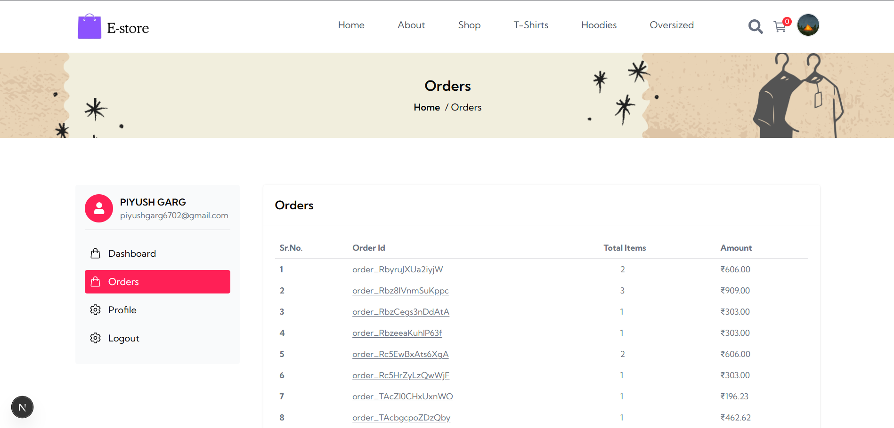
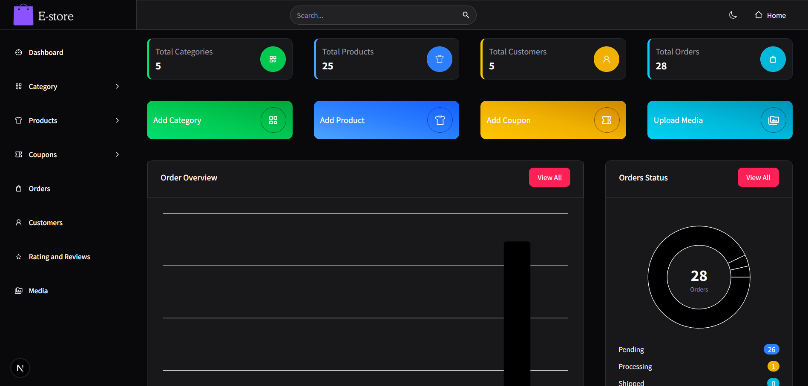

# 🚀 NextCommerce - Full Stack E-Commerce Platform

A production-grade full-stack e-commerce platform with customer storefront, advanced admin dashboard, secure payments, inventory management, and scalable architecture.

<p align="center">
  <a href="https://nextjs.org/"></a>
  <a href="https://react.dev/"></a>
  <a href="https://nodejs.org/"></a>
  <a href="https://www.mongodb.com/"></a>
  <a href="https://tailwindcss.com/"></a>
  <a href="https://redux-toolkit.js.org/"></a>
  <a href="https://jwt.io/"></a>
  <br />
  <a href="https://razorpay.com/"></a>
  <a href="https://cloudinary.com/"></a>
  <a href="https://vercel.com/"></a>
  <a href="LICENSE"></a>
  <a href="https://github.com/piyush-garg-web/NextCommerce"></a>
</p>

<p align="center">
  <strong>
    <a href="https://e-commerce-gilt-seven-85.vercel.app/">⚡ Live Demo</a> 
    &nbsp;•&nbsp; 
    <a href="https://github.com/piyush-garg-web/NextCommerce">💻 GitHub Repository</a> 
    &nbsp;•&nbsp; 
    <a href="https://www.linkedin.com/in/piyushgarg-dev">👔 LinkedIn Profile</a>
  </strong>
</p>

---

## 📌 Introduction

NextCommerce is a high-performance, production-grade full-stack e-commerce platform built to solve complex real-world retail workflows. Leveraging Next.js App Router, React 19, and MongoDB Atlas, it integrates a client-facing storefront with a comprehensive admin dashboard.

The project features a responsive shopping catalog with server-validated shopping carts, promotional coupons, client-side fuzzy search, and multi-option checkout via the Razorpay payment gateway. For administrators, NextCommerce offers aggregated analytics charts, media resource managers, dynamic color-and-size inventory variant sheets, review moderators, and a trash soft-delete system.

---

## 🌟 Project Highlights

- **Production-Style E-Commerce Workflow**: End-to-end shopping experience, checkout logic, and invoice updates.
- **JWT Authentication**: Cookies configured as HTTP-only, secure, and strict.
- **OTP Email Verification**: Automated 6-digit verifications sent directly to user emails.
- **Variant-Level Inventory Management**: Color, size, and pricing matrices assigned individually per variant SKU.
- **Razorpay Payment Integration**: Full support for cards, Netbanking, and UPI, including server-side signature verifications.
- **Admin Analytics Dashboard**: Dynamic chart controls tracking business growth KPIs.
- **Cloudinary Media Management**: Central controls to host and clean CDN resources.
- **Soft Delete Recovery System**: Staging trash folders to recover categories, products, or reviews.

---

## ❓ Why This Project?

Building a typical shopping cart is straightforward. However, resolving the challenges of a production-level platform requires addressing complex real-world engineering hurdles:

1. **Transaction Integrity and Server-Side Stock Validation**: Prevents clients from tampering with cart checkout pricing. NextCommerce checks values against the database before initiating Razorpay invoices.
2. **Variant-Based Product Modeling**: Models products that have hundreds of color-size combinations, each with distinct pricing tables, images, stock counts, and SKUs.
3. **Database Recovery Using Soft Delete**: Prevents catastrophic cascading database errors when category paths are deleted, staging items in a trash heap for easy recovery.
4. **Secure Authentication Architecture**: Restricts API calls and routes server-side using edge-optimized JWT cookies and Next.js middleware.

---

## ⚡ Live Demo

Explore the live NextCommerce application:

* **Live Demo URL**: https://e-commerce-gilt-seven-85.vercel.app/

> **Note:** The customer storefront is publicly accessible.
>
> **Admin Dashboard:** To access the Admin Dashboard, please contact the repository owner for the admin credentials (email & password).

---

## 📸 Screenshots

Here are visual previews of the storefront and checkout screens:

#### Storefront Interface
| Home Page | Shop Catalog |
| :---: | :---: |
|  |  |

| Filtered Catalog | Product Details |
| :---: | :---: |
|  |  |

| Shopping Cart | Secure Checkout |
| :---: | :---: |
|  |  |

| Order Confirmation | User Login |
| :---: | :---: |
|  |  |

| About Page | Orders Summary |
| :---: | :---: |
|  |  |

| Admin Dashboard |
| :---: | 
|  

---

## ⚙️ Features

### 🛍️ Customer Storefront
- **Registration/Login**: User account creation and authentication.
- **OTP Verification**: Email-based account verification.
- **JWT Authentication**: Secure stateless cookie tracking.
- **Product Catalog**: High-performance category browsing.
- **Fuse.js Fuzzy Search**: Instant client-side search matches.
- **Filters**: Filter products by category, price, size, and color.
- **Sorting**: Order by price, name, or date.
- **Redux Persist Cart**: Persistent cart storage in the browser.
- **Coupons**: Apply promotional discount codes.
- **Razorpay Checkout**: Interactive payment overlays.
- **Orders and Tracking**: Full list of transaction invoices and status tracking.

### 🛡️ Admin Dashboard
- **Sales Analytics**: Custom aggregations displaying revenue and order counts.
- **Product CRUD**: Interface to configure the catalog.
- **Variant Management**: Matrices assigning pricing and image assets to color-size combinations.
- **Inventory Control**: Track and restock variant counts.
- **Category Management**: Edit category grouping schemas.
- **Coupon Management**: Configurable promo codes, thresholds, and expiries.
- **Cloudinary Media Management**: Central repository dashboard for uploaded media assets.
- **Review Moderation**: Approve or discard product feedback.
- **Soft Delete Trash Recovery**: Restore accidentally deleted records.

---

## 🛠️ Technology Stack

| Layer | Technologies Used |
|---|---|
| **Frontend** | Next.js App Router, React 19, Tailwind CSS v4, Material UI, Radix UI |
| **Backend** | Next.js API Routes, Node.js, JWT, Jose, BcryptJS |
| **Database** | MongoDB Atlas, Mongoose |
| **State** | Redux Toolkit, Redux Persist |
| **Payments** | Razorpay |
| **Storage** | Cloudinary |
| **Email** | Nodemailer |
| **Deployment** | Vercel |

---

## 📐 System Architecture

The application runs as a modular monolith, routing user requests through secure middleware channels.


### Architectural Flow:
`User / Browser` → `Next.js Frontend` → `API Routes` → `JWT Middleware (Jose)` → `MongoDB Atlas`

*Integrations used*: Redux (cart), React Query (fetching), Cloudinary (images), Nodemailer (OTP mailers), Razorpay (invoices).

---

## 📂 Project Structure

```text
├── app/                  # Next.js App Router root
│   ├── (root)/           # Shared layout route groups
│   │   ├── (admin)/      # Admin panel pages (/admin/*)
│   │   ├── (website)/    # Customer storefront (/shop, /cart, /orders, /profile)
│   │   └── auth/         # Authentication flows (/auth/login, /auth/register, OTP)
│   ├── api/              # Backend REST API endpoints
│   ├── globals.css       # Root stylesheet
│   └── layout.jsx        # Root HTML wrapper
├── components/           # Reusable React components
├── email/                # Nodemailer templates
├── hooks/                # Custom React hooks (React Query calls)
├── lib/                  # Helper utilities (db Connection, zod validation schemas)
├── models/               # MongoDB Mongoose database schemas
├── public/               # Static assets & favicon files
├── routes/               # Navigation route constant configurations
├── screenshots/          # Repository visual documentation captures
├── store/                # Redux Toolkit store config & slices
├── .env.example          # Template configuration file
├── .gitignore            # Version control exclusions
├── LICENSE               # Open-source MIT license parameters
├── middleware.js         # Next.js custom JWT role-based router security
├── package.json          # Package manifest & scripts
└── README.md             # Repository documentation (this file)
```

---

## 📊 Database Design

NextCommerce uses referenced MongoDB schemas to configure relational integrity maps:

- **User**: Profile details, login keys, and authorization roles.
- **Product**: General catalog descriptions, categories, and references.
- **ProductVariant**: Dependent inventory child variant listings assigning sizes, colors, SKUs, prices, stock counts, and image arrays back to parent items.
- **Category**: Catalog category descriptors.
- **Coupon**: Promotional discount rules.
- **Review**: Product feedback configurations.
- **Media**: Central file library indices.
- **Order**: Customer shipping details, invoices, and gateway verification values.
- **OTP**: Temporary signup verification keys utilizing MongoDB TTL indexing.

---

## ⚡ API Endpoint Reference

All REST endpoints accept and return JSON. Detailed schemas can be found in [docs/API.md](docs/API.md).

| Area | Endpoint | Method | Guard | Description |
|---|---|---|---|---|
| **Auth** | `/api/auth/register` | `POST` | Public | Registers a user and sends OTP |
| **Auth** | `/api/auth/verifyotp` | `POST` | Public | Validates signup email OTP |
| **Auth** | `/api/auth/login` | `POST` | Public | Authenticates credentials and sets session cookie |
| **Catalog** | `/api/shop` | `GET` | Public | Lists, sorts, and filters products |
| **Catalog** | `/api/product` | `GET` | Public | Fetches detailed product properties |
| **Cart** | `/api/cart-verification` | `POST` | User | Server-side validation of cart prices/stock |
| **Payment** | `/api/payment/get-order-id` | `POST` | User | Generates Razorpay transaction ID |
| **Payment** | `/api/payment/save-order` | `POST` | User | Cryptographic signature verification and order creation |
| **Admin** | `/api/product` | `POST`/`PUT`/`DELETE` | Admin | Product catalog CRUD (soft-delete) |
| **Admin** | `/api/coupon` | `POST`/`PUT`/`DELETE` | Admin | Coupon configuration CRUD |
| **Admin** | `/api/dashboard` | `GET` | Admin | Fetch sales statistics and chart coordinates |

---

## 🔧 Installation & Local Setup

Deploy the application locally:

### 1. Clone the Repository
```bash
git clone https://github.com/piyush-garg-web/NextCommerce.git
cd NextCommerce
```

### 2. Install Project Dependencies
```bash
npm install
```

### 3. Configure the Environment
Duplicate `.env.example` to create `.env.local`:
```bash
cp .env.example .env.local
```

### 4. Start the Application
```bash
npm run dev
```
Open [http://localhost:3000](http://localhost:3000) to view your local deployment.

---

## 🔑 Environment Variables Configuration

Configure the following values inside `.env.local` to execute backend integrations:

```bash
MONGODB_URL="mongodb+srv://..."
SECRET_KEY="..."
NODEMAILER_HOST="..."
NODEMAILER_PORT="..."
NODEMAILER_EMAIL="..."
NODEMAILER_PASSWORD="..."
NEXT_PUBLIC_BASE_URL="http://localhost:3000"
NEXT_PUBLIC_API_BASE_URL="http://localhost:3000/api"
NEXT_PUBLIC_CLOUDINARY_API_KEY="..."
NEXT_PUBLIC_CLOUDINARY_CLOUD_NAME="..."
CLOUDINARY_SECRET_KEY="..."
NEXT_PUBLIC_CLOUDINARY_UPLOAD_PRESET="..."
NEXT_PUBLIC_RAZORPAY_KEY_ID="..."
RAZORPAY_KEY_SECRET="..."
```

---

## 🛡️ Security Architecture

- **HTTP-Only Cookies**: JWT authentication is transmitted via cookies configured as `HttpOnly`, `Secure`, and `SameSite=Strict`, defending against XSS/CSRF exposures.
- **Secure and SameSite Cookie Settings**: Sessions are strictly scoped to the host domain.
- **JWT Verification Middleware**: Intercepts requests on protected route groups before rendering or API access.
- **Jose Token Validation**: Edge-compatible JWT extraction and validation.
- **Bcrypt Password Hashing**: Hashing algorithm executed pre-save via Mongoose triggers to protect user passwords.
- **Zod Validation**: Input payload validation on both frontend forms and backend REST controllers.
- **NoSQL Injection Prevention**: Escapes query operators to block arbitrary server injections.
- **Razorpay Signature Verification**: Verifies payment callback signatures using HMAC-SHA256 to match Razorpay webhook protocols.

---

## ☁️ Deployment

Deploy NextCommerce to Vercel:

1. **Import GitHub Repository**: Link `piyush-garg-web/NextCommerce` in your Vercel Dashboard.
2. **Add Environment Variables**: Populate all keys from `.env.example` in Vercel project settings.
3. **Deploy**: Trigger production compilation. Vercel automatically deploys the serverless REST endpoints and Edge Middleware rules.

---

## 🔮 Future Enhancements

- **AI Recommendation Engine**: Feed views and ratings into recommendation algorithms.
- **Multi-Vendor Support**: Enable third-party merchant setup profiles.
- **PDF Invoices**: Automatic print-ready PDF attachments sent upon checkout confirmation.
- **Inventory Forecasting**: Predictive inventory warnings using ML trends.
- **SMS Notifications**: Transaction SMS tracking updates.

---

## 👤 Author

**Piyush Garg**  
*Full Stack Developer*

- **Skills**: React, Next.js, Node.js, MongoDB, AI Technologies
- **GitHub**: [https://github.com/piyush-garg-web](https://github.com/piyush-garg-web)
- **LinkedIn**: [https://linkedin.com/in/piyushgarg-dev](https://linkedin.com/in/piyushgarg-dev)

---

## 📄 License

This project is licensed under the MIT License.
