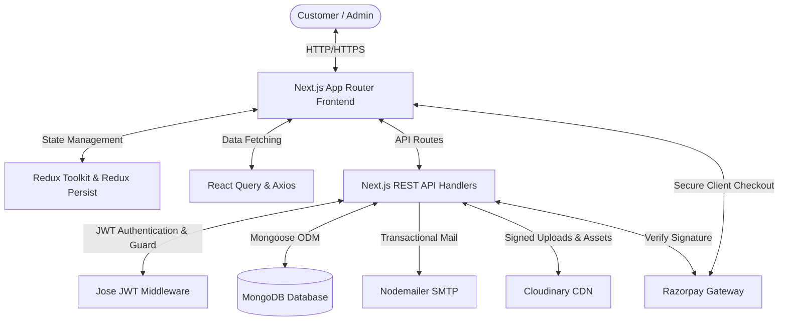
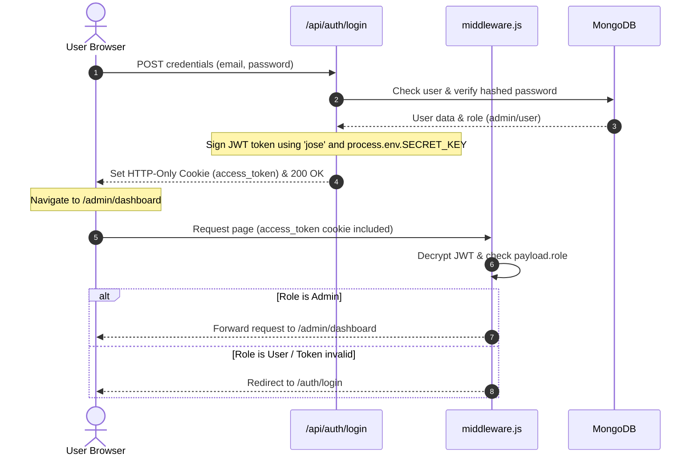
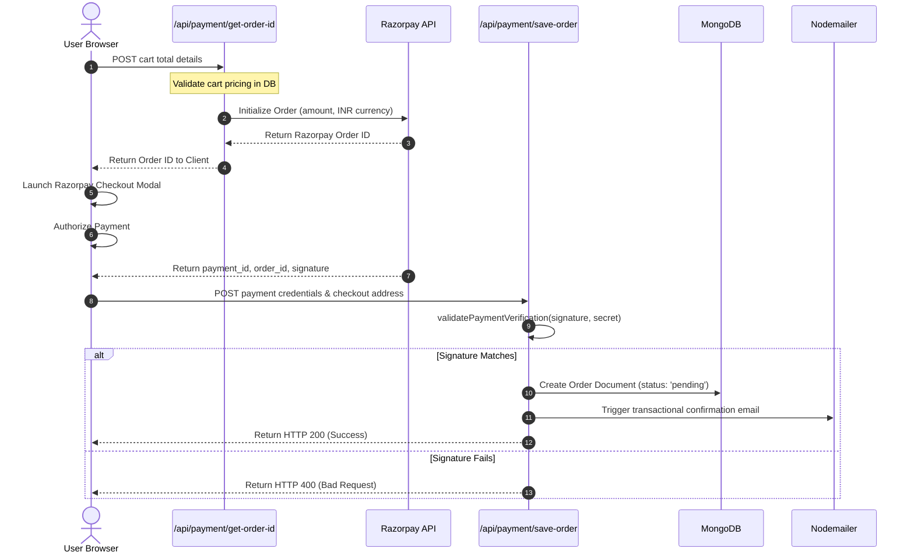

# Architectural Architecture

This document describes the high-level architecture of the Next.js E-Commerce platform, explaining how the frontend, backend, database, and background services interact.

---

## 1. System Overview

The system is structured as a **monolithic Next.js application** utilizing the **App Router**. Next.js acts as both the client-side user interface (SPA) and the server-side API Gateway (REST APIs).



---

## 2. Frontend Layer

The frontend is constructed using **Next.js (App Router)** and styled using **Tailwind CSS v4** combined with **Material-UI (MUI)**.

### Directory Structure & Route Grouping
The client application is organized into route groups under `app/(root)`:
* **`app/(root)/(website)`**: Customer-facing pages including the shop catalog (`/shop`), product details (`/product/[slug]`), shopping cart (`/cart`), profile page (`/myaccount`), and order tracking (`/orders`).
* **`app/(root)/(admin)`**: Protected admin interface (`/admin/*`) containing dashboards, inventory listing tables, coupon grids, client details, and trash bins.
* **`app/(root)/auth`**: Login, registration, OTP email verification, and password reset routes.

### Client-Side State Management
1. **Redux Toolkit (`store/`)**:
   * Manages the active shopping cart state (`cartReducer`), containing product IDs, variants, quantities, and prices.
   * Leverages `redux-persist` to write the cart to `localStorage`, preventing data loss on browser refresh.
2. **React Query (`@tanstack/react-query`)**:
   * Used for fetching, caching, and synchronizing asynchronous server state (e.g., admin customer listings, review submissions, products list).
   * Prevents duplicate network requests.

---

## 3. Backend & API Layer

Next.js **Route Handlers** (`app/api/`) serve as a lightweight REST API.

### Database Connection Management
The database connection is established via Mongoose inside `lib/dbConnection.js`. To prevent exhausting MongoDB connections during Next.js Hot Module Replacement (HMR) in development, it caches the database connection globally:
```javascript
let cache = global.mongoose;
if (!cache) {
  cache = global.mongoose = { conn: null, promise: null };
}
```
It also imports and pre-registers all Mongoose models upon connection to avoid compile-time model overwrite errors.

---

## 4. Key Architectural Flows

### A. Authentication & Route Guard Flow
The application implements custom stateless JWT authentication via HTTP-only cookies (`access_token`).



### B. Secure Checkout & Razorpay Flow
To prevent client-side price tampering, all cart values are verified server-side against MongoDB before generating a transaction.


