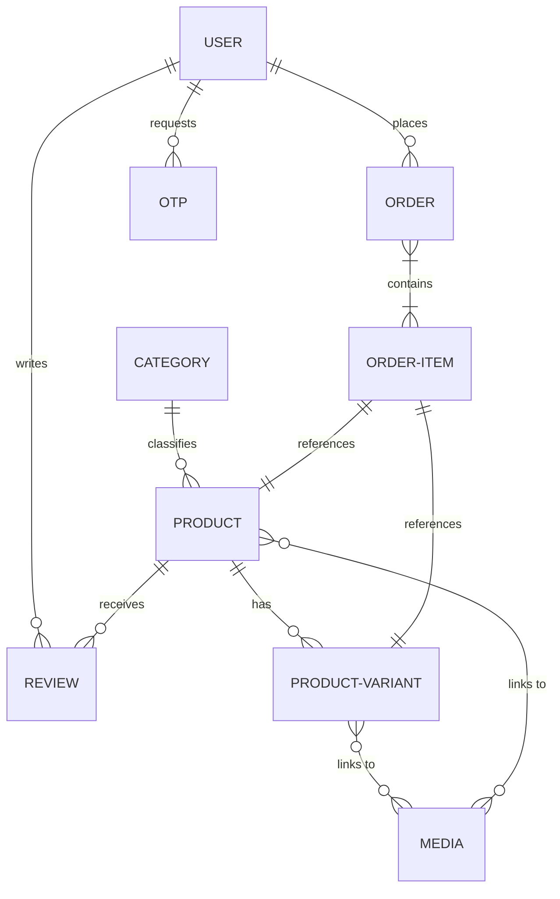

# Database Schema Documentation

This document describes the MongoDB database schemas, relations, indexes, and custom features implemented via Mongoose in this e-commerce project.

---

## 1. Entity Relationship Diagram

The database entities are linked together through standard MongoDB ObjectIDs references.



---

## 2. Schema Definitions

### A. User (`users`)
Stores customer and administrator profile details.
* **`role`**: `String`, enum `['user', 'admin']`, default `'user'`.
* **`name`**: `String` (Required).
* **`email`**: `String` (Required, Unique, Indexed).
* **`password`**: `String` (Required, selected false by default for security).
* **`avatar`**: Sub-document:
  * `url`: `String`
  * `public_id`: `String` (Cloudinary ID)
* **`isEmailVerified`**: `Boolean`, default `false`.
* **`phone`**: `String`.
* **`address`**: `String`.
* **`deletedAt`**: `Date`, default `null` (soft-delete index).
* **`timestamps`**: Automatically generates `createdAt` and `updatedAt`.

### B. Product (`products`)
Stores basic product details.
* **`name`**: `String` (Required).
* **`slug`**: `String` (Required, Unique, Lowercase).
* **`category`**: `ObjectId` -> `Category` (Required, Indexed).
* **`mrp`**: `Number` (Required, manufacturer price).
* **`sellingPrice`**: `Number` (Required, checkout price).
* **`discountPercentage`**: `Number` (Required).
* **`media`**: `Array` of `ObjectId` -> `Media` (Required).
* **`description`**: `String` (Required, rich text input from CKEditor).
* **`deletedAt`**: `Date`, default `null`.

### C. ProductVariant (`productvariants`)
Allows products to have variations in color and size, with individual pricing, SKUs, and images.
* **`product`**: `ObjectId` -> `Product` (Required).
* **`color`**: `String` (Required).
* **`size`**: `String` (Required).
* **`mrp`**: `Number` (Required).
* **`sellingPrice`**: `Number` (Required).
* **`discountPercentage`**: `Number` (Required).
* **`sku`**: `String` (Required, Unique).
* **`media`**: `Array` of `ObjectId` -> `Media` (Required).
* **`deletedAt`**: `Date`, default `null`.

### D. Category (`categories`)
Classifies products.
* **`name`**: `String` (Required).
* **`slug`**: `String` (Required, Unique, Lowercase).
* **`deletedAt`**: `Date`, default `null`.

### E. Coupon (`coupons`)
Promotional codes applied at checkout.
* **`code`**: `String` (Required, Unique).
* **`discountPercentage`**: `Number` (Required).
* **`minShoppingAmount`**: `Number` (Required).
* **`validity`**: `Date` (Required).
* **`deletedAt`**: `Date`, default `null`.

### F. Review (`reviews`)
Customer reviews.
* **`product`**: `ObjectId` -> `Product` (Required).
* **`user`**: `ObjectId` -> `User` (Required).
* **`rating`**: `Number` (Required).
* **`title`**: `String` (Required).
* **`review`**: `String` (Required).
* **`deletedAt`**: `Date`, default `null`.

### G. Media (`medias`)
Central uploads metadata table.
* **`name`**: `String` (Required).
* **`url`**: `String` (Required).
* **`public_id`**: `String` (Required, Cloudinary resource tracking).
* **`format`**: `String`.
* **`bytes`**: `Number`.
* **`deletedAt`**: `Date`, default `null`.

### H. OTP (`otps`)
Stores temporary values for registration & email verification.
* **`email`**: `String` (Required).
* **`otp`**: `String` (Required).
* **`expiresAt`**: `Date` (Required, configured as a MongoDB TTL index to expire after 5 minutes).

### I. Order (`orders`)
Records verified transactions.
* **`user`**: `ObjectId` -> `User` (Optional, allows guest checkouts).
* **`name` / `email` / `phone`**: `String` (Required, shipping coordinates).
* **`country` / `state` / `city` / `pincode` / `landmark`**: `String` (Required).
* **`ordernote`**: `String` (Optional).
* **`product`**: Array of sub-documents:
  * `productId`: `ObjectId` -> `Product` (Required)
  * `variantId`: `ObjectId` -> `ProductVariant` (Required)
  * `name`: `String`
  * `qty`: `Number`
  * `mrp`: `Number`
  * `sellingPrice`: `Number`
* **`subtotal`**: `Number` (Required).
* **`discount`**: `Number` (Required).
* **`couponDiscountAmount`**: `Number` (Required).
* **`taxAmount`**: `Number`, default `0`.
* **`totalAmount`**: `Number` (Required).
* **`status`**: `String`, defaults to `'pending'`.
* **`payment_id`**: `String` (Required, Razorpay payment reference).
* **`order_id`**: `String` (Required, Razorpay order reference).
* **`deletedAt`**: `Date`, default `null`.

---

## 3. Database Features & Constraints

### Soft Delete Mechanism
All primary schema models include a `deletedAt` field (default `null`). 
* When an admin deletes an item (e.g., a product, coupon, review, or category), the application performs a **soft-delete** by setting `deletedAt = new Date()`.
* Public customer queries filter results where `deletedAt: null`.
* The Admin panel includes a **Trash Bin** section. Here, it queries documents where `deletedAt !== null`, allowing administrators to restore deleted data or permanently purge it.

### Mongoose Middleware Hashing
The `User` model leverages a Mongoose `pre('save')` hook to automatically hash raw user passwords with `bcryptjs` using a salt work factor of 10:
```javascript
userSchema.pre('save', async function (next) {
    if (!this.isModified('password')) return next();
    this.password = await bcrypt.hash(this.password, 10);
    next();
});
```
